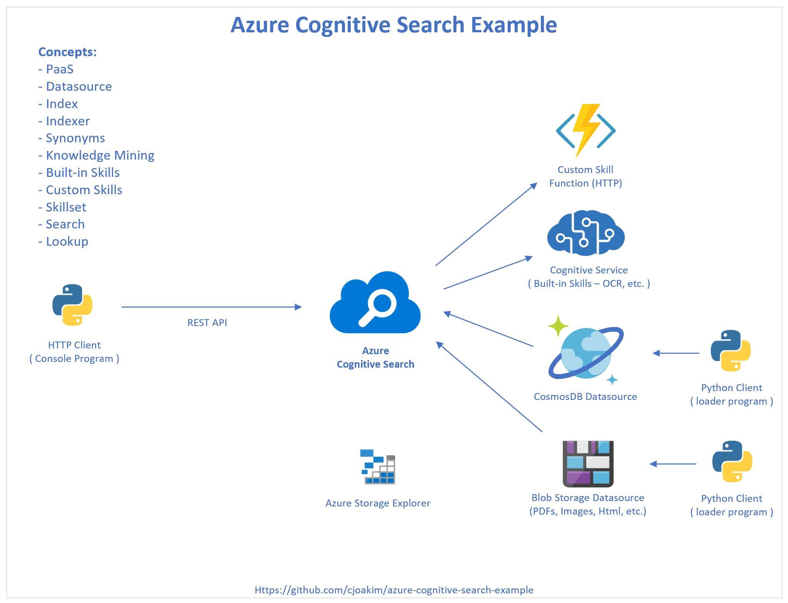

# azure-cognitive-search-example

<p align="center" width="95%">
  
</p>

---

## Project Overview 

This github project demonstrates an Azure Solution based on **Azure Cognitive Search**,
and other Azure PaaS services, including:
- **Azure Cognitive Service** - used by the Search service to invoke **built-in** skills
- **Azure Storage** - stores documents to be indexed
- **Azure CosmosDB** w/SQL API  - stores documents to be indexed
- **Azure Function** implemeting a HTTP-triggered **Custom Cognitive Skill**

**Python 3** is used as the sole programming language for this project, to do the following:
- Generate Azure Cognitive Search JSON **schemas**
- Upload a curated set of documents to Azure Storage; see the documents/ directory
- Upsert JSON Airport documents to CosmosDB; see file data/us_airports.json
- Implement the Custom Cognitive Skill Azure Function; see the FunctionApp/ directory
- Invoke the **REST API** of the **Azure Cognitive Search**, using the **requests** library

Python 3 was chosen because it is cross-platform, practical, and is commonly used by Data Scientists.

The initial implementation of this project focuses on the **bash** shell and the **linux** 
and **macOS** operating systems, but **Windows** and **PowerShell** support will be added
in the near future.

---

## Provisioning Azure Resources

In Azure, you can provision resources in one of several ways, including the **Azure Portal**,
**ARM templates**, the **az CLI**, and others.  Some scripts using the **az CLI** are
provided in this repo; I recommend using the Azure Portal Web UI to create the others.

The az CLI scripts are located in directory **automation/az/**.
Edit file **config.sh** in this directory per your desired Azure Region, Resource Group,
and resource names.

### Azure Cognitive Search

```
$ ./search.sh create
```

### Azure Cognitive Service

```
$ ./cognitive.sh create
```

### Azure Storage

```
$ ./storage.sh create
```

### Azure CosmosDB

Create a Cosmos/SQL account.  Then add a **dev** database, with an **airports** container
specifying a partition key field named **/pk**.

### Azure Function

Create a Function app with your tool-of-choice; Visual Studio, Visual Studio Code, or the
**func** command line tools.  See https://docs.microsoft.com/en-us/azure/azure-functions/functions-run-local?tabs=macos%2Ccsharp%2Cbash

I used the **func** command line tools; see the section below titled **Custom Skill Azure Function**.

---

## Environment Variables

Using environment variables is a "best practice" for handling configuration values on your
workstation.  Using these enables you to eliminate "hard coded" configuration values and
secrets.

This project uses the following environment variables; some example values are shown.
These values can be obtained from Azure Portal once your above resources have been created;
see the keys section of the UI for each service.

Please use your own name and not cjoakim for your Azure Services!

```
AZURE_SUBSCRIPTION_ID= ... your Azure Subscription Id ...
AZURE_COSMOSDB_SQLDB_ACCT=cjoakimcosmossql
AZURE_COSMOSDB_SQLDB_KEY= ... secret ...
AZURE_COSMOSDB_SQLDB_URI=https://cjoakimcosmossql.documents.azure.com:443/
AZURE_SEARCH_STORAGE_ACCOUNT=cjoakimsearch
AZURE_SEARCH_STORAGE_KEY= ... secret ...
AZURE_SEARCH_STORAGE_CONNECTION_STRING= ... secret ...
AZURE_SEARCH_NAME=cjoakimsearch
AZURE_SEARCH_URL=https://cjoakimsearch.search.windows.net
AZURE_SEARCH_ADMIN_KEY= ... secret ...
AZURE_SEARCH_QUERY_KEY= ... secret ...
AZURE_SEARCH_COGSVCS_ALLIN1_KEY= ... secret ...
AZURE_FUNCTION_CUSTOM_SKILL_LOCAL=http://localhost:7071/api/TopWordsSkill
AZURE_FUNCTION_CUSTOM_SKILL_REMOTE=https://cjoakimsearchapp.azurewebsites.net/api/TopWordsSkill?code=...secret...
```

---

## Concepts

- [REST API](https://docs.microsoft.com/en-us/rest/api/searchservice/)
  - [HTTP Status Codes](https://docs.microsoft.com/en-us/rest/api/searchservice/http-status-codes)
  - [HTTP Status Codes; Explained as Dogs](https://httpstatusdogs.com)
  - [Python Requests Library; HTTP for Humans](https://requests.readthedocs.io/en/master/)
- [Indexes](https://docs.microsoft.com/en-us/azure/search/search-get-started-portal)
- [Index from Storage](https://docs.microsoft.com/en-us/azure/search/search-blob-storage-integration)
- [Index from CosmosDB, and document "flattening"](https://docs.microsoft.com/en-us/azure/search/search-howto-index-cosmosdb)
- [Indexers](https://docs.microsoft.com/en-us/azure/search/search-indexer-overview)
- [Synonyms](https://docs.microsoft.com/en-us/azure/search/search-synonyms)
- [Skillsets](https://docs.microsoft.com/en-us/azure/search/cognitive-search-defining-skillset)
- [Skills and Document Cracking](https://docs.microsoft.com/en-us/azure/search/cognitive-search-concept-intro)
- [Built-In Skills](https://docs.microsoft.com/en-us/azure/search/cognitive-search-predefined-skills)
- [Custom Skills](https://docs.microsoft.com/en-us/azure/search/cognitive-search-defining-skillset#add-a-custom-skill)

### Other Links

- [Azure Cognitive Search Overview](https://azure.microsoft.com/en-us/services/search/)
- [Azure Cognitive Search Documentation](https://docs.microsoft.com/en-us/azure/search/)
- [Data Types](https://docs.microsoft.com/en-us/rest/api/searchservice/supported-data-types)
- [API Versions](https://docs.microsoft.com/en-us/rest/api/searchservice/search-service-api-versions)
- [Postman HTTP Client UI](https://www.postman.com)
- [curl HTTP Client CLI program](https://curl.haxx.se/docs/httpscripting.html)

---

## Implementation and Execution

This project is implemented using shell scripts, python programming, and JSON files.

To create the **airports** Index, from CosmosDB JSON documents, run the following:

```
$ ./recreate_airports.sh
```

To create the **documents** Index, from Azure Storages blobs (PDFs, Images, html files), run the following:

```
$ ./recreate_documents.sh
```

See each of these scripts for the details.  But essentially 

### Searching and Lookup

```
$ python search-client.py search_index documents all
$ python search-client.py lookup_doc documents aHR0cHM6Ly9jam9ha2ltc2VhcmNoLmJsb2IuY29yZS53aW5kb3dzLm5ldC9kb2N1bWVudHMvMjAyMS1zdXBlci1jdWItYzEyNS1nYWxsZXJ5LTA0LTI0MDB4YXV0by5qcGc1
```

---

## Built-In Skills

### OCR examples

#### Of the above diagram

```
"imageDescription": [
  "{\"tags\":[\"diagram\"],\"captions\":[{\"text\":\"diagram\",\"confidence\":0.82125532627105713}]}"
],
"imageText": [
  "Azure Cognitive Search Example Concepts: - Paas - Datasource - Index - Indexer - Synonyms - Knowledge Mining - Built-in Skills Custom Skill - Custom Skills Function (HTTP) - Skillset - Search - Lookup O Cognitive Service ( Built-in Skills - OCR, etc. ) REST API HTTP Client Azure ( Console Program ) Cognitive Search Python Client CosmosDB Datasource ( loader program ) Azure Storage Explorer Blob Storage Datasource Python Client (PDFs, Images, Html, etc.) ( loader program ) Https://github.com/cjoakim/azure-cognitive-search-example"
],
"mergedText": " Azure Cognitive Search Example Concepts: - Paas - Datasource - Index - Indexer - Synonyms - Knowledge Mining - Built-in Skills Custom Skill - Custom Skills Function (HTTP) - Skillset - Search - Lookup O Cognitive Service ( Built-in Skills - OCR, etc. ) REST API HTTP Client Azure ( Console Program ) Cognitive Search Python Client CosmosDB Datasource ( loader program ) Azure Storage Explorer Blob Storage Datasource Python Client (PDFs, Images, Html, etc.) ( loader program ) Https://github.com/cjoakim/azure-cognitive-search-example \n",
"topwords": [
  "azure",
  "cognitive",
  "search",
  "datasource",
  "skills",
  "client",
  "program",
  "built-in",
  "custom",
  "http",
  "etc",
  "python",
  "loader",
  "storage",
  "example",
  "concepts:",
  "paas",
  "index",
  "indexer",
  "synonyms"
]
```

---

#### Of a UPS Truck

<p align="center" width="95%">
  
</p>

```
"imageDescription": [
  "{\"tags\":[\"outdoor\",\"truck\",\"road\",\"transport\",\"parked\",\"car\",\"front\",\"sitting\",\"side\",\"bus\",\"large\",\"street\",\"parking\",\"standing\",\"old\",\"green\",\"man\"],\"captions\":[{\"text\":\"a truck is parked on the side of a road\",\"confidence\":0.96122339571435267}]}"
],
"imageText": [
  "ups 150472 Worldwide Services Low Emission Hybrid Electric Vehicle USDOT 021800"
],
"mergedText": " ups 150472 Worldwide Services Low Emission Hybrid Electric Vehicle USDOT 021800 \n",
"topwords": [
  "ups",
  "150472",
  "worldwide",
  "services",
  "low",
  "emission",
  "hybrid",
  "electric",
  "vehicle",
  "usdot",
  "021800"
]
```

---

#### Of a Marathon Finish

<p align="center" width="95%">
  
</p>

```
"imageDescription": [
  "{\"tags\":[\"person\",\"road\",\"outdoor\",\"sport\",\"street\",\"man\",\"walking\",\"holding\",\"woman\",\"people\",\"jumping\",\"young\",\"standing\",\"riding\",\"city\",\"playing\",\"player\",\"group\",\"ball\"],\"captions\":[{\"text\":\"Shalane Flanagan et al. walking down the street\",\"confidence\":0.7455881694062344}]}"
],
"imageText": [
  "B TATA CONSULTANCY SERVICES TATA TCS NEW FLANAGAN 2017 % WOR YORK CITY airbnb"
],
"mergedText": " B TATA CONSULTANCY SERVICES TATA TCS NEW FLANAGAN 2017 % WOR YORK CITY airbnb \n",
"topwords": [
  "tata",
  "consultancy",
  "services",
  "tcs",
  "new",
  "flanagan",
  "2017",
  "wor",
  "york",
  "city",
  "airbnb"
]
```

---

## Custom Skill Azure Function

Creating the Azure Function with the CLI tooling.

First, create the Function App, which will contain the Function(s):

```
az functionapp create \
  --resource-group AzureFunctionsQuickstart-rg \
  --os-type Linux \
  --consumption-plan-location eastus \
  --runtime python \
  --runtime-version 3.7 \
  --functions-version 2 \
  --name <APP_NAME> \
  --storage-account <STORAGE_NAME>
```

Then use the **func** utility to generate and deploy the Azure Function to the Function App.

```
$ func init --help
$ func init FunctionApp --worker-runtime python

$ cd FunctionApp

$ func new --name TopWordsSkill --template "HTTP trigger"

$ ./venv.sh    (with an empty requirements.in file)

  ... edit the generated TopWordsSkill/__init__.py file, which implements the Function ...

$ func start
Found Python version 3.8.5 (python3).
Azure Functions Core Tools (3.0.2912 Commit hash: bfcbbe48ed6fdacdf9b309261ecc8093df3b83f2)
Function Runtime Version: 3.0.14287.0
Hosting environment: Development
Content root path: /Users/cjoakim/github/azure-search-beta/FunctionApp
Now listening on: http://0.0.0.0:7071
Application started. Press Ctrl+C to shut down.

Functions:
	TopWordsSkill: [GET,POST] http://localhost:7071/api/TopWordsSkill
```

Invoke the HTTP Function, running locally, from another Terminal.

```
$ python search-client.py invoke_local_function pyf-onedrop.png
```

After you're satisfied with how the Function runs locally, deploy it to Azure:

```
$ func azure functionapp publish $app_name
  - or -
$ ./publish.sh
```
