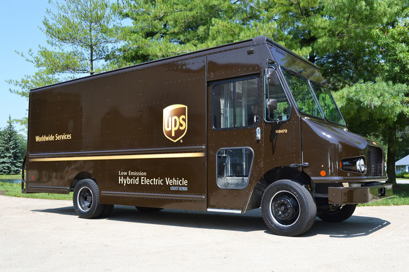

# azure-cognitive-search-example

<p align="center" width="95%">
  
</p>

---


## Links

- [Azure Cognitive Search Overview](https://azure.microsoft.com/en-us/services/search/)
- [Azure Cognitive Search Documentation](https://docs.microsoft.com/en-us/azure/search/)
- [Index from Storage](https://docs.microsoft.com/en-us/azure/search/search-blob-storage-integration)
- [Index from CosmosDB, "flattening"](https://docs.microsoft.com/en-us/azure/search/search-howto-index-cosmosdb)
- [REST API](https://docs.microsoft.com/en-us/rest/api/searchservice/)
  - [HTTP Status Codes](https://docs.microsoft.com/en-us/rest/api/searchservice/http-status-codes)
  - [Python Requests: HTTP for Humans](https://requests.readthedocs.io/en/master/)
- [Data Types](https://docs.microsoft.com/en-us/rest/api/searchservice/supported-data-types)
- [API Versions](https://docs.microsoft.com/en-us/rest/api/searchservice/search-service-api-versions)

## Environment

```
export AZURE_SEARCH_NAME="cjoakimsearch"
export AZURE_SEARCH_URL="https://cjoakimsearch.search.windows.net"
export AZURE_SEARCH_ADMIN_KEY="xxx"
export AZURE_SEARCH_QUERY_KEY="xxx"

export AZURE_SEARCH_STORAGE_ACCOUNT="cjoakimsearch"
export AZURE_SEARCH_STORAGE_KEY="xxx"
export AZURE_SEARCH_STORAGE_CONNECTION_STRING="xxx"

export AZURE_SEARCH_COGSVCS_ALLIN1_NAME="cjoakimsearch"
export AZURE_SEARCH_COGSVCS_ALLIN1_KEY="xxx"
export AZURE_SEARCH_COGSVCS_ALLIN1_URL="https://eastus.api.cognitive.microsoft.com/"


```

---

## Sequence 

---

## Built-In Skills

### OCR examples

#### Of the above diagram

```
"imageDescription": [
  "{\"tags\":[\"diagram\"],\"captions\":[{\"text\":\"diagram\",\"confidence\":0.82125532627105713}]}"
],
"imageText": [
  "Azure Cognitive Search Example Concepts: - Paas - Datasource - Index - Indexer - Synonyms - Knowledge Mining - Built-in Skills Custom Skill - Custom Skills Function (HTTP) - Skillset - Search - Lookup O Cognitive Service ( Built-in Skills - OCR, etc. ) REST API HTTP Client Azure ( Console Program ) Cognitive Search Python Client CosmosDB Datasource ( loader program ) Azure Storage Explorer Blob Storage Datasource Python Client (PDFs, Images, Html, etc.) ( loader program ) Https://github.com/cjoakim/azure-cognitive-search-example"
],
"mergedText": " Azure Cognitive Search Example Concepts: - Paas - Datasource - Index - Indexer - Synonyms - Knowledge Mining - Built-in Skills Custom Skill - Custom Skills Function (HTTP) - Skillset - Search - Lookup O Cognitive Service ( Built-in Skills - OCR, etc. ) REST API HTTP Client Azure ( Console Program ) Cognitive Search Python Client CosmosDB Datasource ( loader program ) Azure Storage Explorer Blob Storage Datasource Python Client (PDFs, Images, Html, etc.) ( loader program ) Https://github.com/cjoakim/azure-cognitive-search-example \n",
"topwords": [
  "azure",
  "cognitive",
  "search",
  "datasource",
  "skills",
  "client",
  "program"
]
```

---

#### Of a UPS Truck

<p align="center" width="95%">
  
</p>

```
"imageDescription": [
  "{\"tags\":[\"outdoor\",\"truck\",\"road\",\"transport\",\"parked\",\"car\",\"front\",\"sitting\",\"side\",\"bus\",\"large\",\"street\",\"parking\",\"standing\",\"old\",\"green\",\"man\"],\"captions\":[{\"text\":\"a truck is parked on the side of a road\",\"confidence\":0.96122339571435267}]}"
],
"imageText": [
  "ups 150472 Worldwide Services Low Emission Hybrid Electric Vehicle USDOT 021800"
],
"mergedText": " ups 150472 Worldwide Services Low Emission Hybrid Electric Vehicle USDOT 021800 \n",
"topwords": [
  "ups",
  "150472",
  "worldwide",
  "services",
  "low",
  "emission",
  "hybrid",
  "electric",
  "vehicle"
]
```

---

#### Of a Marathon Finish

<p align="center" width="95%">
  
</p>

```
  "imageDescription": [
    "{\"tags\":[\"person\",\"road\",\"outdoor\",\"sport\",\"street\",\"man\",\"walking\",\"holding\",\"woman\",\"people\",\"jumping\",\"young\",\"standing\",\"riding\",\"city\",\"playing\",\"player\",\"group\",\"ball\"],\"captions\":[{\"text\":\"Shalane Flanagan et al. walking down the street\",\"confidence\":0.7455881694062344}]}"
  ],
  "imageText": [
    "B TATA CONSULTANCY SERVICES TATA TCS NEW FLANAGAN 2017 % WOR YORK CITY airbnb"
  ],
  "mergedText": " B TATA CONSULTANCY SERVICES TATA TCS NEW FLANAGAN 2017 % WOR YORK CITY airbnb \n",
  "topwords": [
    "tata",
    "consultancy",
    "services",
    "tcs",
    "new",
    "flanagan",
    "2017"
  ]
```

---

## Custom Skill Azure Function

- https://docs.microsoft.com/en-us/azure/azure-functions/functions-run-local?tabs=macos%2Ccsharp%2Cbash
- https://docs.microsoft.com/en-us/azure/azure-functions/functions-reference-python
- https://docs.microsoft.com/en-us/azure/azure-functions/functions-create-first-azure-function-azure-cli?tabs=bash%2Cbrowser&pivots=programming-language-python
- https://docs.microsoft.com/en-us/azure/search/cognitive-search-custom-skill-python

```
$ func init --help
$ func init FunctionApp --worker-runtime python

$ cd FunctionApp

$ func new --name TopWordsSkill --template "HTTP trigger"

$ ./venv.sh    (with an empty requirements.in file)

$ func start
Found Python version 3.8.5 (python3).
Azure Functions Core Tools (3.0.2912 Commit hash: bfcbbe48ed6fdacdf9b309261ecc8093df3b83f2)
Function Runtime Version: 3.0.14287.0
Hosting environment: Development
Content root path: /Users/cjoakim/github/azure-search-beta/FunctionApp
Now listening on: http://0.0.0.0:7071
Application started. Press Ctrl+C to shut down.

Functions:

	TopWordsSkill: [GET,POST] http://localhost:7071/api/TopWordsSkill
```

```
az functionapp create --resource-group AzureFunctionsQuickstart-rg --os-type Linux --consumption-plan-location westeurope --runtime python --runtime-version 3.7 --functions-version 2 --name <APP_NAME> --storage-account <STORAGE_NAME>
``

## Issues 

```

Field 'content' contains a term that is too large to process. The max length for UTF-8 encoded terms is 32766 bytes. The most likely cause of this error is that filtering, sorting, and/or faceting are enabled on this field, which causes the entire field value to be indexed as a single term. Please avoid the use of these options for large fields.

https://stackoverflow.com/questions/38311911/content-too-large-when-indexing-blob-content-for-azure-search
" If the content field in your search index is marked as filterable, facetable or sortable then you'll hit this limit (regardless of whether the field is marked as searchable or not)."

    {
      "name": "content",
      "type": "Edm.String",
      "searchable": "true",
      "filterable": "false",  <-- changed to false
      "sortable": "false",    <-- changed to false
      "facetable": "false"    <-- changed to false
    },
```

```
Field 'mergedText' contains a term that is too large to process. The max length for UTF-8 encoded terms is 32766 bytes. The most likely cause of this error is that filtering, sorting, and/or faceting are enabled on this field, which causes the entire field value to be indexed as a single term. Please avoid the use of these options for large fields.
```


```
SELECT c.id, c.pk, c.location.type FROM c
SELECT c.id, c.pk, c.location.type, c.location.coordinates[0] as longitude, , c.location.coordinates[1] as latitude FROM c
```